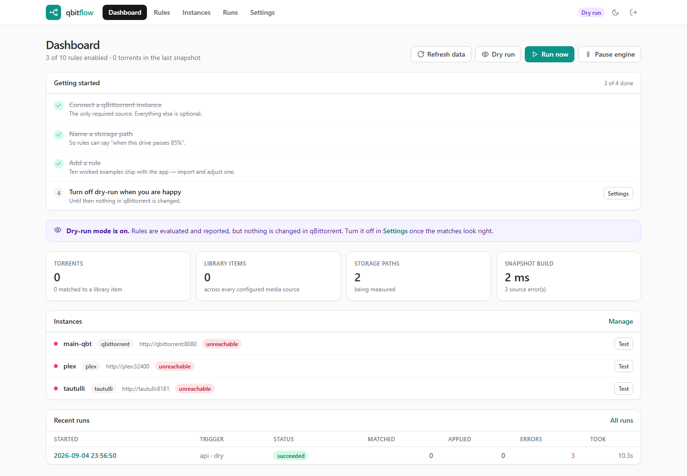
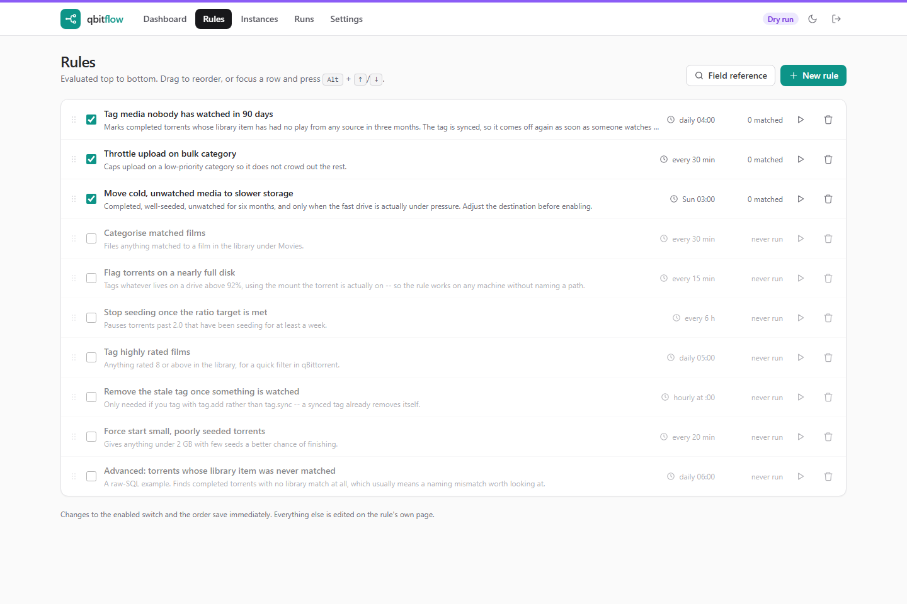
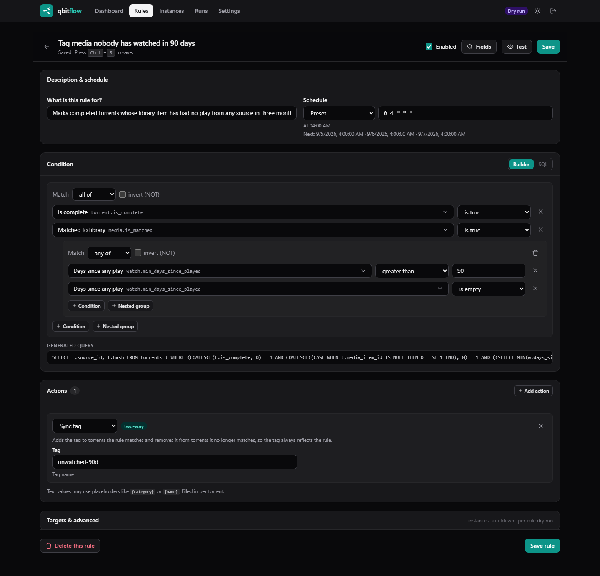
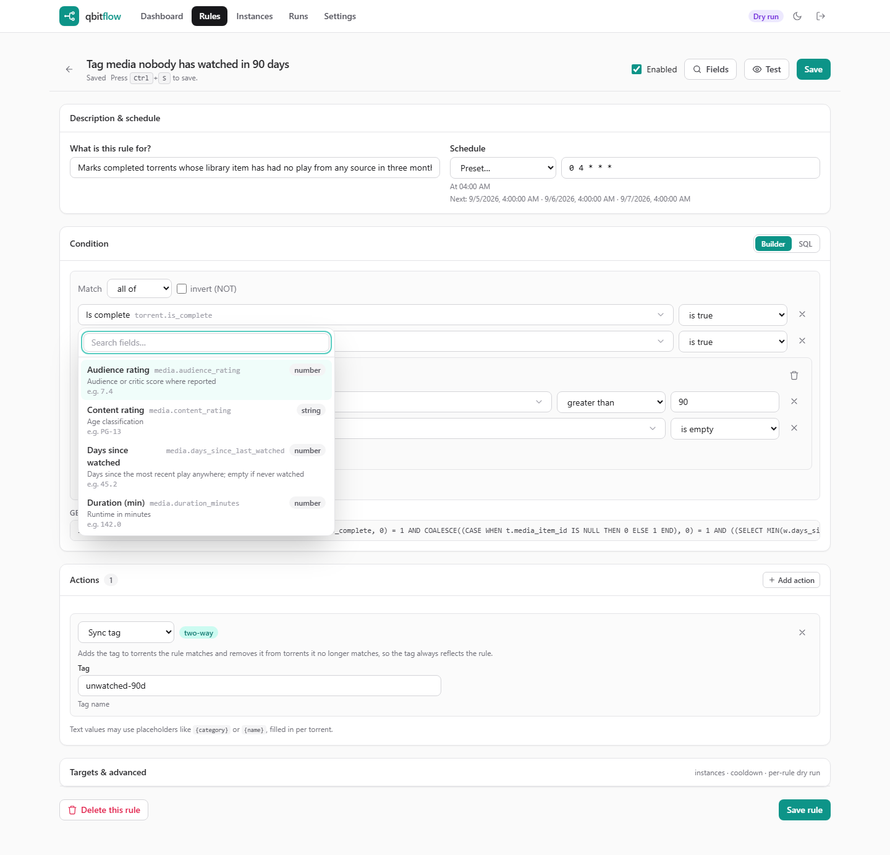
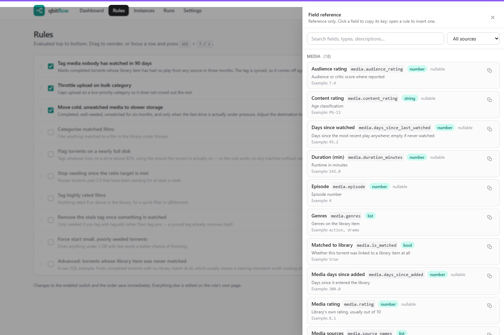
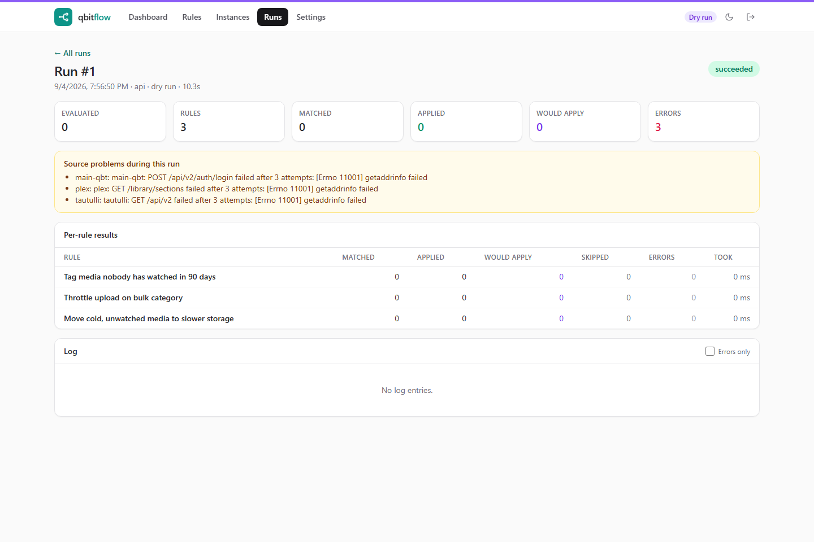
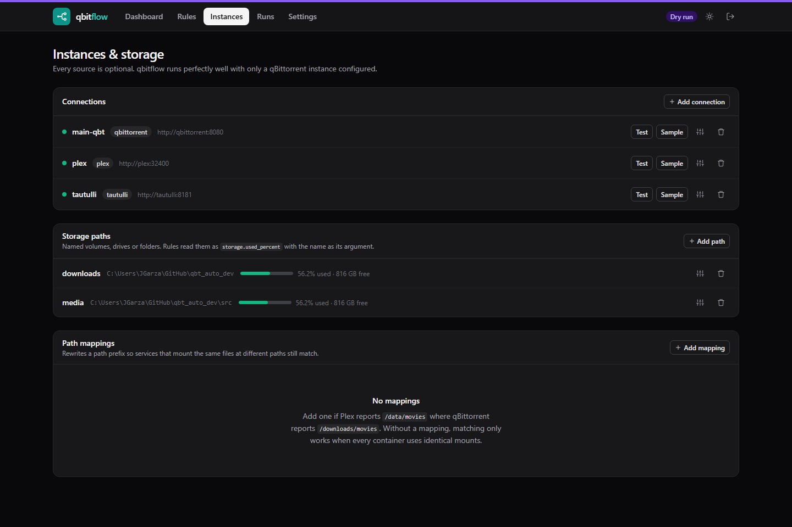

# qbitflow

Rule-driven automation for qBittorrent, informed by your media libraries and your disks.

qbitflow collects data from Plex, Jellyfin, Tautulli, Jellystat, Jellyglance, one or more
qBittorrent instances and a set of storage paths you name; materialises all of it into a
consistent snapshot; evaluates your rules against that snapshot on a schedule; and applies
batched actions back to qBittorrent.

The rules people actually want look like this:

> *Tag anything nobody has watched in ninety days — and untag it the moment somebody does.*
>
> *Move cold, well-seeded media to the slow drive, but only while the fast drive is above 85%.*
>
> *Throttle the bulk category so it stops crowding out everything else.*

All three are shipped as examples. None of them require writing SQL.

---

## Contents

- [Quick start](#quick-start)
- [How it works](#how-it-works)
- [Configuring sources](#configuring-sources)
- [Path mapping](#path-mapping)
- [Writing rules](#writing-rules)
- [Actions](#actions)
- [Scheduling](#scheduling)
- [Settings](#settings)
- [Environment reference](#environment-reference)
- [Backup, import and export](#backup-import-and-export)
- [Security](#security)
- [Development](#development)
- [Reference documentation](#reference-documentation)

---

## Quick start

```bash
curl -O https://raw.githubusercontent.com/jgarza9788/qbitflow/master/docker-compose.yml
docker compose up -d
```

Open <http://localhost:8080>. The first page is a setup wizard that creates your
administrator account; it never appears again.

Then, in order:

1. **Sources** — add your qBittorrent instance and press *Test connection*. Add Plex,
   Jellyfin, Tautulli or the others if you want library and watch data. Everything except
   qBittorrent is optional, and the app runs perfectly well with qBittorrent alone.
2. **Sources → Storage paths** — name the disks you want rules to reason about. A path that
   is missing or unmounted reports as unavailable rather than failing the cycle.
3. **Settings → Import** — press *Load examples* for ten worked rules, import them
   (they arrive disabled), then open one in the rule editor and adjust it.
4. **Leave dry-run on** until a run's results look right. It is on by default on a fresh
   install, and nothing in qBittorrent changes while it is.

> **`PUID` / `PGID` matter.** If qbitflow moves a file, qBittorrent still has to be able to
> read it. Set these to the user that owns your media.

### Without Docker

```bash
uv sync
uv run alembic upgrade head
uv run uvicorn qbitflow.main:app --host 0.0.0.0 --port 8080
```

---

## How it works

Each cycle does four things.

**1. Fetch, once per source.** Every source is fetched at most once per cycle no matter how
many rules want its data, behind a TTL cache with a per-source lock, so fifty rules asking
about torrents produce one call to qBittorrent. Sources are fetched concurrently and are
isolated from each other: an unreachable Plex records an error and is skipped, and the cycle
completes.

**2. Build a snapshot.** Everything collected is written into a fresh in-memory SQLite
database and swapped in atomically. Every rule in the cycle sees the same immutable copy, so
two rules can never disagree about the state of a torrent. Normalisation happens here, once
— path keys, sizes in gigabytes, days since a timestamp, the mount each torrent's save path
resolves to — rather than being recomputed per rule.

Torrents are matched to library items through an ordered strategy chain, each step recording
its own confidence: exact filename (1.0) → path segment (0.8) → title and year (0.7/0.6) →
fuzzy title match (0.4–0.55, behind a threshold). File size within ±2% breaks a tie; it never
makes a match on its own.

**3. Evaluate.** Your condition tree compiles to one parameterised `SELECT` that returns the
whole matched set. There is no per-torrent loop, and values are always bound parameters — a
torrent named `" OR 1=1 --` is data, not syntax. Fifty rules over ten thousand torrents take
around 0.4 seconds; `tests/integration/test_benchmark.py` holds that to a one-second budget.

**4. Act.** Handlers return *intents* rather than performing calls. The runner groups them by
instance, operation and resolved parameters and flushes each group as one batched request —
tagging 500 torrents is one HTTP call, not 500.

Every handler checks the current state first, so:

- running a rule twice changes nothing the second time;
- a dry run reports **Skipped** for torrents that are already correct, not a misleading
  **Would apply**.

Outcomes are five-valued — **Applied**, **Would apply**, **Skipped**, **Not applicable**,
**Error** — which is what makes a run summary mean something.

---

## Configuring sources

| Source | What it contributes | Notes |
| --- | --- | --- |
| **qBittorrent** | Torrents, and every action | The only required source. Multiple instances supported. |
| **Plex** | Library items, ratings, genres, view history | Paginated; episodes fetched in one request per section. |
| **Jellyfin** | Library items, lifetime play counts | Has no windowed history API — see below. |
| **Tautulli** | Windowed watch history for Plex | The most reliable source of "watched in the last N days". |
| **Jellystat** | Watch history for Jellyfin | Endpoints configurable — see below. |
| **Jellyglance** | Watch history for Jellyfin | Endpoints configurable — see below. |
| **Storage paths** | Disk totals, usage, optional folder sizes | Named by you; percentages are 0–100. |

**Jellyfin reports only a lifetime total.** `UserData.PlayCount` has no time dimension, so
qbitflow reports it as the `all` window and no other. A rule asking "played in the last week"
gets nothing from Jellyfin rather than a wrong answer. Pair it with Jellystat or Tautulli when
windowed history matters.

**Tautulli withholds the lifetime total when its history was truncated.** History is read
newest-first up to `max_history_records` (default 20,000). If more exists than was read, the
`all` window is not reported — claiming a lifetime count from a partial read would
under-count exactly the long-lived items these rules are about.

**Jellystat and Jellyglance are unverified.** Their APIs could not be tested against live
instances during development, so instead of hard-coding a guess, the request path, method,
response key and field names are all options on the source connection. If the shipped default
is wrong for your build, the connection test says so and you correct it in the UI — no code
change, no new image. The options are `health_path`, `history_path`, `history_method`,
`rows_key`, `auth_header`, `history_body` and `field_map`.

### Credentials from the environment

Any source's connection details can be supplied by environment variable instead of being
stored in the database, so secrets can stay out of the volume entirely:

```
QBITFLOW_SOURCE__<NAME>__BASE_URL
QBITFLOW_SOURCE__<NAME>__USERNAME
QBITFLOW_SOURCE__<NAME>__SECRET
```

`<NAME>` is the source name upper-cased with non-alphanumerics replaced by `_` — a source
named `main-qbt` reads `QBITFLOW_SOURCE__MAIN_QBT__SECRET`. Environment values win over the
database and are never written back to it.

Secrets that *are* stored are encrypted with AES-256-GCM using a key from
`QBITFLOW_SECRET_KEY`, or a generated `chmod 600` key file under `/data/keys/`.

---

## Path mapping

Plex reports `/data/movies/Film.mkv`. qBittorrent reports `/downloads/movies/Film.mkv`. They
are the same file, and without help nothing matches.

Path mappings rewrite each source's paths into a common form before matching. Add them per
source under **Sources**, longest prefix first:

| Source | From | To |
| --- | --- | --- |
| plex | `/data` | `/media` |
| main-qbt | `/downloads` | `/media` |

You do not need identical bind mounts, and you do not need to change either application's
configuration.

---

## Writing rules

A rule is: a **condition**, one or more **actions**, and a **schedule**.

### The builder

Conditions are built as a tree of groups — AND/OR, negation, and nesting to ten levels. The
compiled SQL is shown live and read-only beneath the builder, so the abstraction is always
inspectable, and **Test against current torrents** shows you exactly which torrents match
before you enable anything.

The field panel lists all 80 fields with their type, description and a live sample value from
your own connected instances, searchable and click-to-insert. Operators are served by the API
per field type, so the UI cannot advertise an operator the compiler does not implement.

See **[docs/fields.md](docs/fields.md)** for the full list.

A few worth knowing about:

| Field | Why it matters |
| --- | --- |
| `watch.min_days_since_played` | Days since the *most recent* play across every reporting source. Empty means never watched — usually you want `> 90 OR is empty`. |
| `torrent.mount_used_percent` | Usage of the disk this torrent actually lives on. A disk-pressure rule written with this is portable; one written against a named mount is not. |
| `media.is_matched` | Whether the torrent was linked to a library item at all. Guard media conditions with it. |
| `storage.used_percent` | Takes a qualifier: which of *your* named paths you mean. |

### Advanced mode

If the builder cannot express something, write the `WHERE` clause yourself against the
snapshot schema — see **[docs/snapshot-schema.md](docs/snapshot-schema.md)**:

```sql
t.is_complete = 1 AND t.media_item_id IS NULL AND t.size_gb > 1
```

Raw SQL runs on a read-only connection behind a SQLite authorizer that permits `SELECT` on
the snapshot tables and nothing else, with a statement timeout and a row cap, and it is
validated with `EXPLAIN` before it can be saved. Helper functions (`days_since`, `size_gb`,
`regex_match`, `path_matches`, `contains_token`) are available, but the precomputed columns
are faster — a function forces SQLite to evaluate row by row.

---

## Actions

Eleven handlers: `tag.add`, `tag.remove`, `tag.sync`, `category.set`, `torrent.move`,
`speed.limit`, `seeding.start`, `seeding.stop`, `seeding.forceStart`, `torrent.export`,
`script.run`. Full parameter reference in **[docs/actions.md](docs/actions.md)**.

**Prefer `tag.sync` over `tag.add`.** It is bidirectional: it adds the tag to what the rule
matches *and removes it from what the rule no longer matches*, so the tag always means what
the rule says. With `tag.add` you need a second rule to clean up, and it will drift.

String parameters accept placeholders from the matched torrent — `{name}`, `{category}`,
`{hash}`, `{save_path}`, `{content_path}`, `{state}`, `{source_name}`, `{tags}` — so
`/mnt/cold/{category}` does what it looks like. An unknown placeholder fails the action rather
than writing a literal brace into a path.

Two carry warnings:

- **`torrent.move`**'s *verify path exists* check tests **this container's** filesystem, not
  qBittorrent's. If they see different paths, turn it off; the check is advisory.
- **`script.run`** executes commands on the qbitflow host and is disabled unless
  `QBITFLOW_ENABLE_SCRIPT_ACTION=true`. Commands are split with shell-style quoting and
  executed directly — never through a shell — because arguments interpolate torrent names,
  and a torrent name is chosen by whoever made the torrent.

---

## Scheduling

Each rule has its own cron schedule, with a plain-English description and the next three run
times shown as you type. A human phrase ("every 30 minutes", "daily at 4am") is accepted and
converted.

**Minimum interval is five minutes.** Anything faster is clamped to `*/5 * * * *` and the UI
says so and why. A rule cannot overlap itself: if a run is still going when the next fires,
the new one is skipped rather than queued.

Cycles are owned by the application, not by the HTTP request that triggered them, so a run
started with **Run now** completes even if you close the tab.

---

## Settings

| Setting | Default | Notes |
| --- | --- | --- |
| Engine enabled | on | Global kill switch. |
| Dry run | **on** | Global. A rule may also force dry-run for itself. |
| Parallelism | medium | Low = 2, Medium = 4, High = 8, Very high = 16 concurrent workers, applied to both source fetching and action execution. |
| Stop on first match | off | Whether a matched torrent stops being considered by later rules. |
| Run retention | 200 | Runs kept. Pruned by a maintenance task, never inside a run. |
| Per-host connection cap | 8 | Caps concurrency per instance on top of the tier, so a small NAS is not flooded. |
| Action batch size | 100 | Hashes per batched qBittorrent call. |
| Source TTL overrides | — | Per source kind, how long a fetch stays fresh. |

On a Raspberry Pi or a small NAS, leave parallelism at **low** or **medium**. The tiers apply
to both fetching and acting, and the per-host cap applies on top.

---

## Environment reference

| Variable | Default | Purpose |
| --- | --- | --- |
| `QBITFLOW_DATA_DIR` | `data` | Database, keys. The volume to back up. |
| `QBITFLOW_DB_PATH` | `<data_dir>/qbitflow.db` | Override the database location. |
| `QBITFLOW_SECRET_KEY` | *(generated)* | Base64 AES key for stored credentials. Back it up. |
| `QBITFLOW_SECRETS_KEY_DIR` | `<data_dir>/keys` | Where a generated key is written. |
| `QBITFLOW_EXPORTS_DIR` | `exports` | Default destination for `torrent.export`. |
| `QBITFLOW_HOST` / `QBITFLOW_PORT` | `0.0.0.0` / `8080` | Bind address. |
| `QBITFLOW_ALLOWED_HOSTS` | `*` | Set to your hostnames when exposed beyond the LAN. |
| `QBITFLOW_BEHIND_PROXY` | `false` | Trust `X-Forwarded-*`. Only behind a proxy you control. |
| `QBITFLOW_SESSION_TTL_HOURS` | `336` | Session lifetime (14 days). |
| `QBITFLOW_LOG_LEVEL` | `INFO` | |
| `QBITFLOW_LOG_JSON` | `false` | Structured output for log shippers. |
| `QBITFLOW_ENABLE_SCRIPT_ACTION` | `false` | Enables `script.run`. Read its warning first. |
| `QBITFLOW_TIMEZONE` | `UTC` | Default schedule timezone; a rule may override it. |
| `QBITFLOW_TESTING` | `false` | Suppresses scheduler startup. For tests. |
| `PUID` / `PGID` / `TZ` | `1000` / `1000` / `UTC` | Container identity, applied by the entrypoint. |

---

## Backup, import and export

Back up **`/data`**. It holds the database and, unless you supplied `QBITFLOW_SECRET_KEY`
yourself, the encryption key — lose it and every stored credential must be re-entered.

**Settings → Export** produces YAML or JSON of sources, storage paths, path mappings,
settings and rules, with **every credential redacted**. An export is safe to paste into an
issue. Import previews by default and writes nothing until you confirm, and **imported rules
always arrive disabled** — a shared rule set must not start moving files the moment it lands.

---

## Security

- **argon2id** password hashing; sessions are an opaque random token in an `HttpOnly`,
  `SameSite=Lax` cookie, with only its SHA-256 stored server-side. The credential is never in
  a cookie.
- The auth gate **fails closed** — if it cannot determine who you are, it returns 503 rather
  than serving the page.
- CSRF tokens on every mutating request; `TrustedHostMiddleware` when `ALLOWED_HOSTS` is set.
- The login error is identical for a wrong password and a username that does not exist.
- Condition values are always bound parameters. Raw SQL is authorised by SQLite itself, not by
  inspecting the string.
- Stored credentials are AES-256-GCM encrypted, and are never returned by the API or included
  in an export.

qbitflow has no multi-user model and no roles. It is a single-administrator application; put
it behind a VPN or a reverse proxy with its own auth before exposing it to the internet.

---

## Development

```bash
uv sync
uv run pytest                       # full suite, including the 10k-torrent benchmark
uv run ruff check src tests
uv run python scripts/gen_docs.py   # after changing a field, action or the schema
uv run python scripts/screenshots.py   # re-shoot every page, light and dark, and
                                       # fail on any console error
npx tailwindcss -i src/qbitflow/web/static/app.src.css \
                -o src/qbitflow/web/static/app.css --minify
```

The layout:

```
src/qbitflow/
  sources/      one module per provider, behind a single adapter interface
  snapshot/     schema, media-key normalisation, matching, build-and-swap
  conditions/   field registry, condition tree, SQL compiler, raw-SQL guard
  actions/      the eleven handlers, each declaring its own parameter model
  engine/       runner, scheduler, cooldowns, log bus
  auth/         passwords, sessions, middleware
  api/ web/     JSON API and the server-rendered pages
```

Adding a source is one file in `sources/` plus a registry entry. Adding an action is one
class with a `@register` decorator — its parameter model then drives validation, the API and
the editor form together.

`docs/fields.md`, `docs/actions.md` and `docs/snapshot-schema.md` are generated; a test fails
if they are stale.

---

## Reference documentation

- **[docs/fields.md](docs/fields.md)** — all 80 fields, operators by type, helper functions
- **[docs/actions.md](docs/actions.md)** — every action and its parameters
- **[docs/snapshot-schema.md](docs/snapshot-schema.md)** — the snapshot tables and full DDL

## Screenshots

Light and dark are both first-class; every page is also usable on a phone.
These are generated by `scripts/screenshots.py`, so they cannot drift from the
real interface — `docs/screenshots/` holds the full set, including the dark and
mobile variants of each.

### Dashboard

A new install gets an ordered checklist rather than a wall of zeroes, and the
band across the top of every page says whether the engine will actually touch
your files.



### Rules

Evaluated top to bottom, drag or `Alt`+arrows to reorder. Disabled rules are
dimmed, the enabled switch saves immediately, and deleting asks first.



### Rule editor

Each rule has its own page and URL. The builder nests to four levels, the
generated SQL is shown read-only underneath, and **Test** shows exactly which of
your torrents match before you enable anything.



### Field picker

All 80 fields, filtered as you type, each showing its type, what it means, and a
value from your own instances rather than an invented example.



### Field reference

The same registry as a searchable panel, with the helper functions and the
snapshot tables for raw-SQL mode.



### Run history



### Instances and storage


